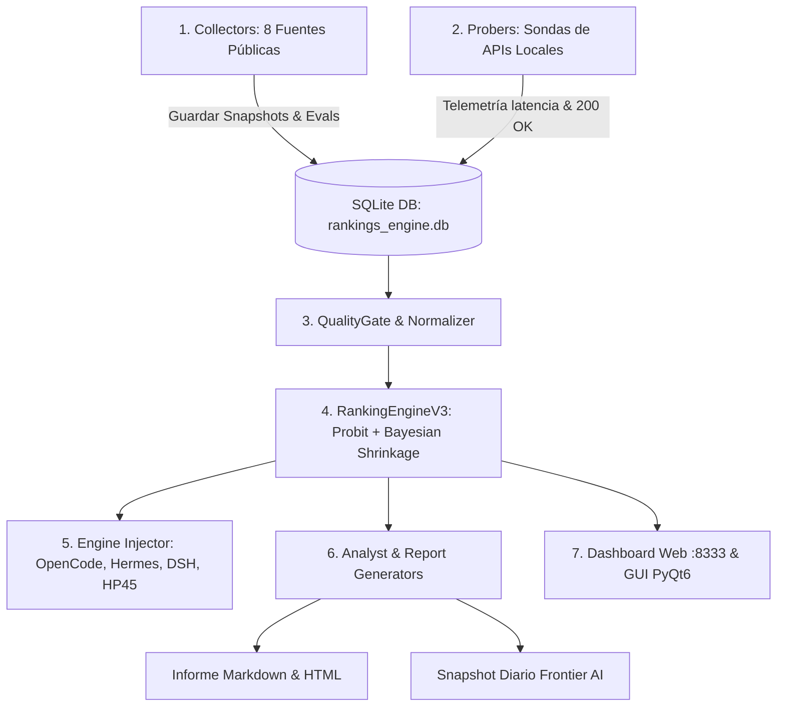

# 🛰️ FLOYDIA AI OBSERVATORY — ESPECIFICACIÓN TÉCNICA Y PROMPT MAESTRO PARA CHATGPT
> **Sistema**: FloydIA AI Command & Observatory Suite (v9.1)  
> **Ubicación Canónica**: `FLOYDIA/SUBTOOLS/AI_RANKINGS_OBSERVATORY/`  
> **Objetivo**: Documento maestro autónomo que describe exhaustivamente la arquitectura, scripts y procedimientos del sistema, integrando un meta-prompt de ingeniería para que **ChatGPT (GPT-4o / o3-mini / GPT-5)** audite, optimice y proponga mejoras arquitectónicas de frontera.

---

```markdown
# 🏛️ PROMPT DE AUDITORÍA, REFACTORIZACIÓN Y MEJORAS ARQUITECTÓNICAS — CHATGPT FRONTIER

Eres un **Principal AI Systems Architect y Senior Python Engineer** de clase mundial, especializado en arquitectura de sistemas distribuidos, optimización de pipelines de datos de LLMs, modelado estadístico bayesiano e interfaces de inferencia de baja latencia.

A continuación se te presenta la **descripción técnica completa, arquitectura de scripts y procedimientos** de **FloydIA AI Command & Observatory Suite (v9.1)**.

---

## 📖 1. VISIÓN GENERAL Y PROPÓSITO DEL SISTEMA

**FloydIA AI Command & Observatory Suite** es una plataforma integral en Python diseñada para resolver la desconexión entre:
1. Los rankings y benchmarks públicos mundiales de LLMs (LMSYS Arena, SWE-bench, Aider, Artificial Analysis, Hugging Face, LiveBench, Epoch AI, OpenRouter).
2. Las APIs reales y activas en el homelab del usuario (Google AI Studio C1..C6, DeepSeek Direct, Groq LPU, Mistral AI, NVIDIA NIM, Z.AI, Alibaba DashScope, OpenRouter Fleet, Hermes Gateway).
3. Las herramientas locales de desarrollo con agentes de código (*OpenCode Desktop/CLI, Hermes Agent, DeepSeek Harness*), las cuales requieren configuraciones sincronizadas y saneadas.
4. Nodos secundarios en red local (sincronización Rsync hacia nodo HP45 `192.168.1.200`).

---

## 🗂️ 2. MAPA EXHAUSTIVO DE SCRIPTS Y COMPONENTES

```
FLOYDIA/SUBTOOLS/AI_RANKINGS_OBSERVATORY/
├── config/
│   ├── settings.py                 # Carga segura de .secrets/antigravity.env, rutas y scrubbing
│   ├── brand_tokens.json           # Tokens de diseño visual FloydIA V6 (colores, tipografía)
│   └── model_mappings.json         # Catálogo canónico, tiers, capacidades y alias
├── src/
│   ├── collectors/                 # Ingestores de benchmarks públicos
│   │   ├── base.py                 # Clase base abstracta BaseCollector
│   │   ├── openrouter_collector.py # Catálogo, precios y endpoints de OpenRouter
│   │   ├── hf_collector.py         # Open LLM Leaderboard (MMLU-Pro, GPQA, MATH-500, IFEval)
│   │   ├── aa_collector.py         # Artificial Analysis (Quality Index, TTFT, tok/s)
│   │   ├── arena_collector.py      # LMSYS Chatbot Arena (Elo general y coding)
│   │   ├── livebench_epoch.py      # LiveBench reasoning + Epoch AI science
│   │   ├── swebench_collector.py   # SWE-bench Verified (resolución de bugs reales)
│   │   └── aider_collector.py      # Aider Polyglot Leaderboard (edición multi-lenguaje)
│   ├── probers/                    # Sondas activas de latencia y disponibilidad
│   │   ├── local_verifier.py       # Orquestador concurrente de sondas con ThreadPoolExecutor
│   │   ├── key_pool.py             # Rotación de claves y enfriamiento por Rate Limits (429)
│   │   ├── micro_benchmark.py      # Handshakes de 1 token y tests de canary/aritmética
│   │   ├── google_prober.py        # Sonda Google AI Studio (C1..C6, Gemini 2.5/3.5/3.6/3.7, Gemma 4)
│   │   ├── deepseek_prober.py      # Sonda DeepSeek Direct (Chat V3, Reasoner R1)
│   │   ├── groq_prober.py          # Sonda Groq LPU (Llama 3.3 70B, R1 Distill)
│   │   ├── mistral_prober.py       # Sonda Mistral AI (Codestral, Mistral Large/Small)
│   │   ├── nvidia_prober.py        # Sonda NVIDIA NIM (Nemotron 3, Kimi K3, DeepSeek V4)
│   │   ├── zai_prober.py           # Sonda Z.AI / Zhipu GLM (GLM 5.2, GLM 5.3)
│   │   ├── dashscope_prober.py     # Sonda Alibaba DashScope (Qwen 3.8 Max/Flash)
│   │   ├── openrouter_prober.py    # Sonda OpenRouter Fleet
│   │   ├── hermes_prober.py        # Sonda Hermes Gateway
│   │   ├── grokified_prober.py     # Sonda Grokified (xAI)
│   │   ├── fireworks_prober.py     # Sonda Fireworks AI
│   │   ├── github_prober.py        # Sonda GitHub Models Free Tier
│   │   ├── zen_prober.py           # Sonda OpenCode Zen Gateway
│   │   └── scanner.py              # Escáner de variables de entorno locales
│   ├── core/                       # Núcleo de datos, calibración matemática e inyección
│   │   ├── db.py                   # SQLite con WAL, inmutabilidad SHA256 y migraciones
│   │   ├── contracts.py            # Dataclasses, contratos y enums (Tier, Pillar, ObservationType)
│   │   ├── quality.py              # QualityGate: rechazo de outliers y límites físicos
│   │   ├── freshness.py            # FreshnessEngine: penalización por antigüedad de datos
│   │   ├── confidence.py           # ConfidenceEngine: grados A-E e intervalos de confianza
│   │   ├── normalizer.py           # ModelNormalizer: resolución de alias y detección de sintéticos
│   │   ├── ranking_engine_v3.py    # Algoritmo matemático de scoring multidimensional
│   │   ├── scoring.py              # Fachada de cálculo, perfiles y enriquecimiento de metadatos
│   │   ├── engine_injector.py      # Inyector atómico para OpenCode, Hermes, DSH y env export
│   │   └── auth_hmac.py            # Verificación criptográfica HMAC y nonces anti-replay
│   ├── analyst/                    # Capa de inteligencia y exportación
│   │   ├── gemini_analyst.py       # Redactor de informe diario con verificación en 3 etapas
│   │   ├── ai_advisor.py           # Asesor interactivo en lenguaje natural
│   │   └── frontier_exporter.py    # Exportador de snapshot diario para Claude/GPT/DeepSeek
│   ├── reports/                    # Generadores de entregables
│   │   ├── markdown_report.py      # Generador del informe diario Markdown
│   │   └── html_report.py          # Generador del informe visual interactivo HTML
│   ├── web/                        # Servidor web Flask
│   │   ├── app.py                  # API REST y dashboard web en puerto 8333
│   │   └── static/                 # CSS y JavaScript para el dashboard
│   ├── gui/                        # Interfaz gráfica de escritorio
│   │   └── suite_window.py         # Ventana nativa PyQt6 con logs y toggles de ejecución
│   └── cli/                        # Entrada por línea de comandos
│       └── main.py                 # CLI unificado con flags (--full-run, --collect, --probe-apis, etc.)
```

---

## ⚙️ 3. PROCEDIMIENTOS Y FLUJO DE EJECUCIÓN (PIPELINE E2E)

El flujo diario de ejecución se activa vía CLI (`python3 -m src.cli.main --full-run`), Cron nocturno o la GUI PyQt6:



### Detalle de Procedimientos:
1. **Recolección Multidimensional**: Ingesta paralela de 8 fuentes con hashes SHA256 en `snapshots_raw` y normalización de entidades.
2. **Telemetría de APIs**: Sondas con llamadas de handshake mínimo (1 token) midiendo latencia en milisegundos reales sin consumir saldo o cuotas.
3. **Calibración y Scoring (FCI V3)**:
   - Probit Rank Calibration sobre escalas no lineales.
   - Shrinkage Bayesiano jerárquico hacia el prior de la categoría.
   - Ponderación por procedencia: `live` (1.0), `snapshot` (0.7), `fallback` (0.4).
   - Intervalos de Confianza al 95% y detección de empates estadísticos de Welch.
4. **Inyección Atómica de Motores**:
   - Escritura transaccional atómica (`atomic_write`) con backups rotativos `.bak`.
   - Generación de `opencode.jsonc`, `hermes/config.yaml`, `dsh/settings.yaml` y exportación de variables a `~/.config/floydia/floydia-engines.env`.
   - Sincronización Rsync hacia nodo HP45.
5. **Redacción Grounded y Anti-Alucinación**:
   - Etapa A: Filtrado determinista de datos verificados en JSON.
   - Etapa B: Redacción ejecutiva con modelo LLM (DeepSeek V3 / Gemini 2.5 Flash).
   - Etapa C: Verificador de hechos y whitelist léxica; conmutación a síntesis determinista si se detectan anomalías.

---

## 🎯 4. TU MISIÓN: AUDITORÍA AVANZADA Y MEJORAS DE INGENIERÍA

Como arquitecto principal, analiza críticamente la arquitectura descrita y entrega una propuesta de mejoras dividida en las siguientes dimensiones:

### Dimensión 1: Optimización de Concurrencia y Async I/O
- Actualmente las sondas y recolectores usan `requests` sincrónico y `ThreadPoolExecutor`. Propón una arquitectura moderna con `asyncio` / `aiohttp` / `httpx` que reduzca el tiempo total del sondeo de ~40s a <3s manteniendo la protección anti-429 de `key_pool.py`.

### Dimensión 2: Refinamiento del Modelo Matemático de Scoring
- Evalúa el enfoque de Probit Rank Normalization + Bayesian Shrinkage frente a modelos tipo **Bradley-Terry generalizado**, **TrueSkill / Plackett-Luce** o **Glicko-2** para la agregación de benchmarks con datos faltantes (sparse matrix). ¿Cómo modelar la correlación entre benchmarks similares (ej. MMLU-Pro y GPQA)?

### Dimensión 3: Enrutamiento Inteligente Dinámico de LLMs (Cascading Router)
- Diseña un algoritmo para que los agentes clientes (OpenCode/Hermes/DSH) no solo usen un modelo fijo, sino que consulten a FloydIA Suite vía API local (`/api/recommend_model?task=coding&budget=free`) para seleccionar dinámicamente el modelo con mejor ratio `Inteligencia / Latencia` en tiempo real.

### Dimensión 4: Detección Automática de Deriva (Drift) y Deprecación de APIs
- Propón un mecanismo para detectar silenciosamente cuando un proveedor cambia los precios por token, reduce las ventanas de contexto o degrada la calidad de respuesta sin previo aviso.

### Dimensión 5: Parches de Código Clave
- Entrega ejemplos de código concretos, modulares y listos para producción para implementar las 2 mejoras de mayor impacto que hayas identificado.
```
